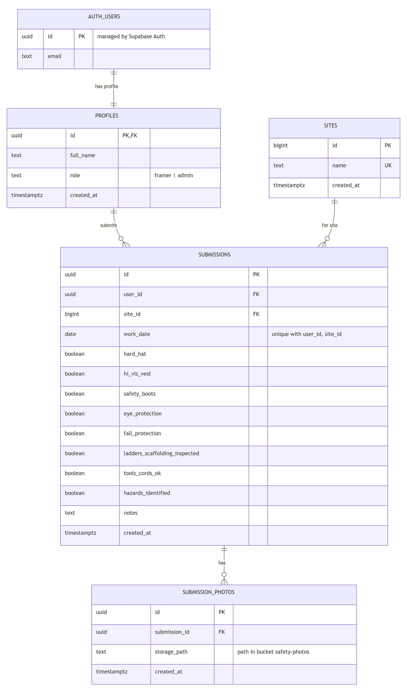

# RAS Site Safety Forms

An internal tool for Ron Anderson & Sons crews. Before starting work, a framer fills in a daily safety form for their job site and attaches photos. Admins see who submitted forms, on which site and when, and can review the photos.

## Live demo

**https://ras-safety.vercel.app**

## Test credentials

| Role   | Email               | Password       |
|--------|---------------------|----------------|
| Admin  | admin@example.com   | RasAdmin2026!  |
| Framer | framer1@example.com | RasFramer2026! |
| Framer | framer2@example.com | RasFramer2026! |
| Framer | framer3@example.com | RasFramer2026! |

## Features

**Framer (works on a phone)**
- Daily safety form: job site, date, safety checklist, notes, one or more photos
- The worker name comes from the logged-in account
- Validation (required fields, image type and size) with success and error messages
- A list of their own submissions with a detail view

**Admin**
- Today's summary: who submitted on each site, and which framers have not submitted yet
- A list of all submissions (worker, site, date, status)
- Filters by site, worker and date range
- A detail view with the checklist, notes and photos

## Tech stack

- **React 19 + Vite**: frontend
- **Tailwind CSS v4**: styling and responsive layout
- **Supabase**: Postgres database, authentication and file storage
- **Vercel**: hosting

There is no custom backend server. The React app talks to Supabase directly through `supabase-js`, and access control is enforced in the database with Row Level Security (RLS). Because of that, the rules can't be bypassed from the browser.

## Security

- Each user has a profile (`profiles`) with a role: `framer` or `admin`. New users get `framer` by default; the admin role is assigned manually.
- RLS policies:
  - framers can read and create only their own submissions and photos;
  - admins can read everything (checked with the `private.is_admin()` function).
- There are no update or delete policies, so submitted forms can't be changed, and nobody can change their own role.
- Photos are stored in a **private** Storage bucket, in a folder per user (`{user_id}/{submission_id}/...`). They are shown through signed URLs that expire after 1 hour.
- Public sign-up is disabled: accounts are created by an administrator in Supabase.
- The frontend only uses the Supabase publishable key, which is safe to expose; the secret key is never used in the app.

## Database



- `profiles`: one-to-one with Supabase `auth.users`; stores name and role
- `sites`: job sites
- `submissions`: one row per form, with the checklist stored as boolean columns
- `submission_photos`: one row per photo; the file itself is in Storage

Full schema with policies: [`supabase/schema.sql`](supabase/schema.sql). Seed data: [`supabase/seed.sql`](supabase/seed.sql).

## Project structure

```
src/
├── App.jsx                     # auth state, picks the screen by role, header
├── lib/
│   ├── supabase.js             # Supabase client
│   └── utils.js                # checklist items, status, today's date
├── pages/
│   ├── LoginPage.jsx
│   ├── FramerPage.jsx          # safety form + own submissions
│   └── AdminPage.jsx           # summary, filters, all submissions
└── components/
    ├── SubmissionForm.jsx
    ├── SubmissionList.jsx      # table shared by both roles
    └── SubmissionDetail.jsx    # checklist, notes, photos
```

## Local setup

1. Install dependencies:
   ```bash
   npm install
   ```
2. Create a Supabase project and run `supabase/schema.sql` in the SQL Editor.
3. In Supabase Storage, create a **private** bucket named `safety-photos` (5 MB file limit, `image/jpeg`, `image/png`, `image/webp`).
4. In Authentication:
   - disable public sign-up;
   - create the users;
   - set names and the admin role in the `profiles` table.
5. Run `supabase/seed.sql` to add job sites and sample submissions.
6. Copy `.env.example` to `.env.local` and fill in the project URL and publishable key:
   ```
   VITE_SUPABASE_URL=https://your-project.supabase.co
   VITE_SUPABASE_PUBLISHABLE_KEY=sb_publishable_...
   ```
7. Start the dev server:
   ```bash
   npm run dev
   ```

## Assumptions

- One form per worker per site per day (enforced with a unique constraint).
- **Status** is derived from the checklist: "All clear" when every item is checked, otherwise the number of issues.
- "Not submitted today" means all framers without a form for today; workers are not assigned to specific sites.
- The form date can't be in the future.
- At least one photo is required; JPG, PNG or WebP, up to 5 MB each.
- Each role has a single screen, so the app doesn't use a router; the detail view opens in place of the list.
- Brand colors and the logo are taken from rasltd.ca and the @rasltdframing Instagram. The fonts (Saira, Nunito) are free look-alikes of the fonts used on the website.

## Known limitations and future improvements

- Photos are uploaded before the form is saved. If saving fails, uploaded files can remain in Storage without a form. A database function could make this a single transaction.
- Filtering happens in the browser, which is fine for a small internal dataset. For larger data the filters can move into the database query.
- Submissions can't be edited or deleted.
- Possible next steps: assigning workers to sites, an "add worker" page for admins, CSV export, email reminders for missing forms.

## AI usage

AI tools were used for guidance and reference. All code was reviewed by me, and I understand how it works.
